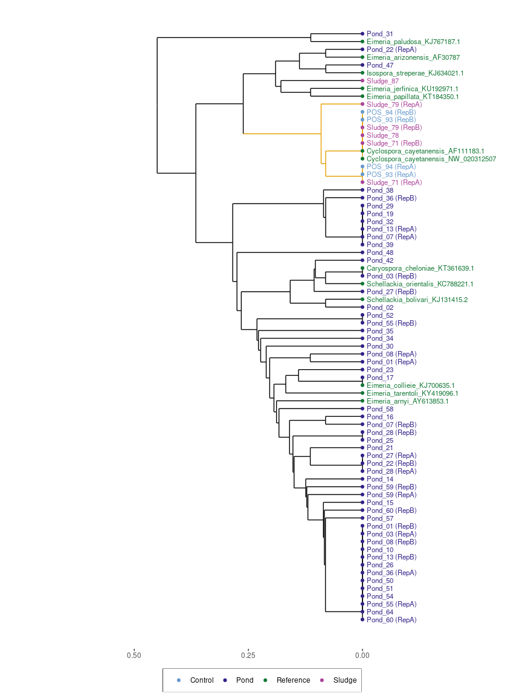

18S Dendrogram 
================
Ann Arfken (<qyr9@cdc.gov>)
<br />First created on November 11, 2023. Updated on 2023-11-20

#### R Markdown

## Packages

``` r
library(ggplot2)
library(cluster)
library(ggtree)
library(msa)
library(seqinr)
library(ggdendro)
library(ggnewscale)
```

    ##                   package loadedversion
    ## BiocGenerics BiocGenerics        0.36.1
    ## Biostrings     Biostrings        2.58.0
    ## cluster           cluster         2.1.2
    ## ggdendro         ggdendro        0.1.23
    ## ggnewscale     ggnewscale         0.4.9
    ## ggplot2           ggplot2         3.3.5
    ## ggtree             ggtree         2.4.2
    ## IRanges           IRanges        2.24.1
    ## msa                   msa        1.22.0
    ## S4Vectors       S4Vectors        0.28.1
    ## seqinr             seqinr         4.2-8
    ## XVector           XVector        0.30.0

## Create Distance Tree

Read fasta file

``` r
Aln_18S <- readDNAStringSet("18S_alignment.fasta", format = "fasta")
```

Align fasta reads using msa

``` r
msa_18S <- msa(Aln_18S)
```

    ## use default substitution matrix

``` r
msa_18S_conv <- msaConvert(msa_18S, type="seqinr::alignment")
```

Create distance matrix

``` r
dist_18S <- dist.alignment(msa_18S_conv,"identity",1)
mat_18S <- as.matrix(dist_18S)
```

Cluster

``` r
clust_18S <- as.hclust(agnes(x=mat_18S, diss = TRUE, stand = TRUE, method = "average"))
```

Convert to dendrogram

``` r
dendro_18S <- as.dendrogram(clust_18S)
```

## Extract data

Extract necessary data for ggplot2

``` r
dend_data <- dendro_data(dendro_18S, type="rectangle")
```

## Add customized labels (optional)

``` r
new_labels <- read.csv("18S_labels_dendro_new.csv")

labs <- label(dend_data)
labs$name <- new_labels[['Label_2']]
labs$group <- new_labels[['Type']]
```

## Add customized segements (optional)

``` r
new_segs <- read.csv("18S_segments.csv")

dend_data$segments$color <- new_segs[['Color']]
```

## Plot

Plot circular cladogram

``` r
theme_set(theme_bw())

base <- ggplot(dend_data$segments) +
  geom_segment(aes(x = x, y = y, xend = xend, yend = yend, color=color), ##plot tree branches
               show.legend=FALSE) +
  scale_color_manual(values=c("black","#E69F00")) ##segment (select tree branch colors)

base +
  new_scale_color() + ##allows for more than one color scale on plotting object
  geom_text(data = dend_data$labels, aes(x, y, label = labs$name, colour=labs$group), ##position and label tree tips
            hjust = 0, angle = 0, size = 3, nudge_y=0.01, show.legend = FALSE) + 
  geom_point(data = dend_data$labels, aes(x, y, colour=labs$group)) + ##add points to tree tips (use this shape for legend)
  coord_flip() + 
  scale_color_manual(values=c("#6699CC","#332288","#117733","#AA4499")) +
  scale_y_reverse(expand = c(0.5,0.1), breaks= c(0,0.25,0.50)) + ##expand y-axis so that names are not cut off; remove neg. y-axis breaks
  theme(axis.line.y=element_blank(),
        axis.ticks.y=element_blank(),
        axis.text.y=element_blank(),
        axis.title.y=element_blank(),
        axis.title.x=element_blank(),
        panel.border=element_blank(),
        panel.grid=element_blank(),
        legend.position="bottom",
        legend.title=element_blank(),
        legend.box.background=element_rect(colour="black"),
        legend.spacing.y=unit(0,"mm"))
```


